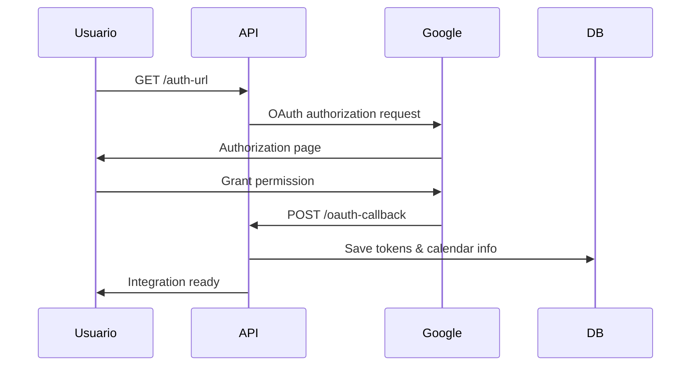
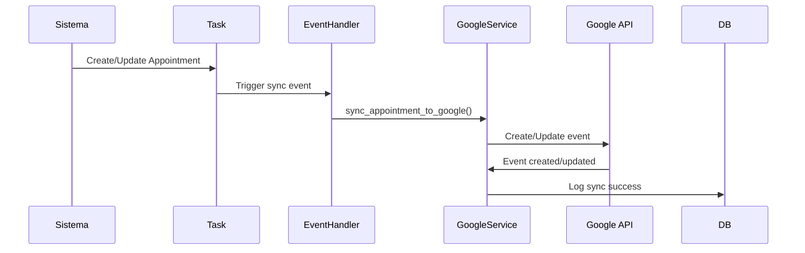
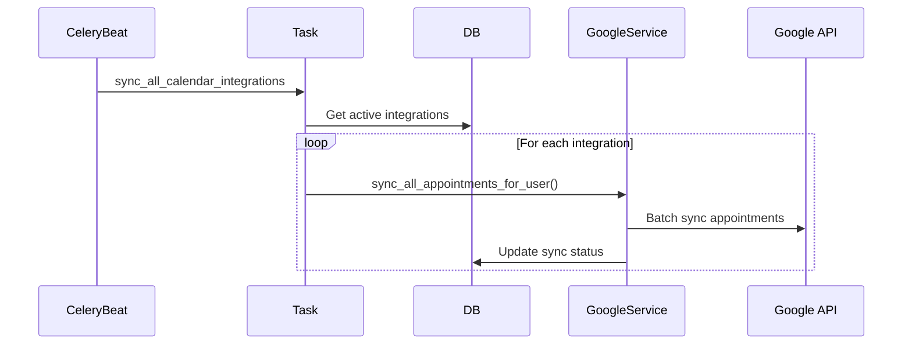

# 📅 Integração Google Calendar - Sistema Ativo

## **Resumo da Implementação**

O sistema de **integração Google Calendar** foi completamente implementado, substituindo as funcionalidades falsas por um sistema real e funcional de sincronização bidirecional.

### **Funcionalidades Falsas Eliminadas:**
❌ **Feature flag sem implementação**: `"calendar_integration": True`  
❌ **Configurações OAuth sem uso**: `GOOGLE_CALENDAR_CLIENT_ID/SECRET`  
❌ **Endpoint básico de calendar**: Apenas visualização local  

### **Sistema Real Implementado:**
✅ **OAuth 2.0 completo** com refresh tokens  
✅ **Sincronização bidirecional** automática  
✅ **Tasks periódicas** de sincronização  
✅ **Event handlers** para agendamentos  
✅ **API completa** de gerenciamento  

---

## **🏗️ Arquitetura Implementada**

### **1. Modelos de Dados**
📍 `app/models/google_calendar_integration.py`

#### **GoogleCalendarIntegration**
```python
# OAuth Tokens (encrypted)
access_token: str
refresh_token: str  
token_expires_at: datetime

# Calendar Settings
calendar_id: str          # ID do calendário Google
calendar_name: str        # Nome do calendário
sync_direction: str       # "bidirectional", "to_google", "from_google"

# Sync Configuration
sync_config: JSON = {
    "sync_past_days": 7,
    "sync_future_days": 30,
    "event_prefix": "[Agendamento]",
    "include_client_info": True,
    "reminder_minutes": [15, 60]
}
```

#### **CalendarSyncLog**
```python
# Tracking completo de sincronizações
sync_direction: str       # Direção da sync
action: str              # "create", "update", "delete"  
status: str              # "success", "error", "skipped"
google_event_id: str     # ID do evento no Google
error_message: str       # Detalhes de erro
```

### **2. Serviço de Integração**
📍 `app/services/google_calendar_service.py`

#### **Funcionalidades Principais:**
- **OAuth Flow Completo**: Autorização e renovação automática de tokens
- **Sincronização Inteligente**: Detecta mudanças e sincroniza apenas necessário
- **Gerenciamento de Eventos**: Criar, atualizar, deletar no Google Calendar
- **Template Dinâmico**: Usa variáveis das configurações da empresa
- **Error Handling**: Recuperação automática de erros

#### **Métodos Principais:**
```python
# OAuth
get_auth_url(user_id, redirect_uri) -> str
handle_oauth_callback(code, user_id, redirect_uri) -> GoogleCalendarIntegration

# Sincronização
sync_appointment_to_google(appointment) -> bool
delete_appointment_from_google(appointment) -> bool
sync_all_appointments_for_user(user_id, days_back, days_forward) -> dict

# Status
get_integration_status(user_id) -> dict
```

### **3. API Endpoints**
📍 `app/api/v1/endpoints/google_calendar.py`

#### **Endpoints Disponíveis:**
```
GET    /api/v1/google-calendar/auth-url          # Obter URL de autorização
POST   /api/v1/google-calendar/oauth-callback    # Processar callback OAuth
GET    /api/v1/google-calendar/status            # Status da integração
GET    /api/v1/google-calendar/integration       # Detalhes da integração
PUT    /api/v1/google-calendar/integration/toggle          # Ativar/desativar
PUT    /api/v1/google-calendar/integration/sync-settings   # Configurações
POST   /api/v1/google-calendar/sync/manual                 # Sincronização manual
POST   /api/v1/google-calendar/sync/appointment/{id}       # Sync específico
DELETE /api/v1/google-calendar/integration                 # Desconectar
GET    /api/v1/google-calendar/sync-logs                   # Logs de sync
```

### **4. Tasks Automáticas**
📍 `app/tasks/google_calendar_tasks.py`

#### **Tasks Periódicas:**
- **`sync_all_calendar_integrations`**: A cada 4 horas - Sincroniza todos usuários
- **`sync_recent_appointments`**: A cada 15 minutos - Sincroniza mudanças recentes  
- **`cleanup_expired_tokens`**: Diário às 2h - Limpa tokens expirados

#### **Event Handlers:**
📍 `app/services/appointment_event_handlers.py`
- **Criação**: Sincroniza automaticamente novos agendamentos
- **Atualização**: Atualiza eventos no Google quando agendamento muda
- **Cancelamento**: Remove eventos do Google Calendar

---

## **🔄 Fluxo de Sincronização**

### **1. Configuração Inicial**


### **2. Sincronização Automática**


### **3. Sincronização Periódica**


---

## **⚙️ Configurações**

### **1. Variáveis de Ambiente**
```env
# Google Calendar OAuth
GOOGLE_CALENDAR_CLIENT_ID=your_client_id
GOOGLE_CALENDAR_CLIENT_SECRET=your_client_secret
```

### **2. Configurações por Usuário**
```json
{
  "sync_past_days": 7,
  "sync_future_days": 30, 
  "conflict_resolution": "manual",
  "event_prefix": "[Agendamento]",
  "include_client_info": true,
  "include_notes": true,
  "reminder_minutes": [15, 60],
  "timezone": "America/Sao_Paulo"
}
```

### **3. Templates de Evento**
Os eventos no Google Calendar são criados usando as variáveis do sistema de templates:

```
Título: [Agendamento] Corte de Cabelo - João Silva
Descrição:
  Serviço: Corte de Cabelo
  Duração: 30 min
  Cliente: João Silva
  Telefone: (11) 99999-9999
  Email: joao@email.com
  Profissional: Maria Santos
  Status: confirmed
```

---

## **📱 Como Usar**

### **1. Para Desenvolvedores**

#### **Executar Migrations:**
```bash
cd backend
alembic upgrade head
```

#### **Configurar OAuth no Google:**
1. Ir para [Google Cloud Console](https://console.cloud.google.com/)
2. Criar projeto ou usar existente
3. Habilitar Google Calendar API
4. Criar credenciais OAuth 2.0
5. Adicionar redirect URIs do seu app
6. Configurar variáveis de ambiente

#### **Dependências Python:**
```bash
pip install google-auth google-auth-oauthlib google-auth-httplib2 google-api-python-client
```

### **2. Para Usuários Finais**

#### **Conectar Google Calendar:**
1. Ir para configurações do perfil
2. Clicar em "Conectar Google Calendar"
3. Autorizar acesso no Google
4. Configurar preferências de sincronização
5. Agendamentos sincronizam automaticamente

#### **Gerenciar Integração:**
```javascript
// Frontend - Obter status
const response = await fetch('/api/v1/google-calendar/status');
const status = await response.json();

// Frontend - Sincronização manual  
const syncResult = await fetch('/api/v1/google-calendar/sync/manual', {
  method: 'POST'
});
```

---

## **🔧 Dependências Instaladas**

### **Python Packages:**
```
google-auth==2.25.2
google-auth-oauthlib==1.2.0
google-auth-httplib2==0.2.0
google-api-python-client==2.111.0
```

### **Modelos Relacionados:**
- ✅ `GoogleCalendarIntegration` - Configurações OAuth por usuário
- ✅ `CalendarSyncLog` - Histórico de sincronizações
- ✅ `User` - Relacionamento 1:1 com integração
- ✅ `Appointment` - Sincronização automática via events

---

## **📊 Monitoramento**

### **1. Logs de Sincronização**
```python
# Verificar status das integrações
GET /api/v1/google-calendar/sync-logs

# Response:
{
  "logs": [
    {
      "id": 123,
      "appointment_id": 456,
      "action": "create",
      "status": "success", 
      "synced_at": "2024-01-26T22:30:00Z",
      "google_event_id": "abc123def456"
    }
  ]
}
```

### **2. Métricas de Sincronização**
- **Total de integrações ativas**: Query `GoogleCalendarIntegration.is_active = True`
- **Taxa de sucesso**: `status = 'success'` vs `status = 'error'` nos logs
- **Tokens expirados**: `token_expires_at < NOW()`
- **Última sincronização**: `last_sync_at` por usuário

### **3. Health Checks**
```python
# Task de limpeza automática
cleanup_expired_tokens()  # Remove integrações órfãs

# Verificação de conectividade  
check_google_api_status()  # Valida credenciais globais
```

---

## **🔒 Segurança**

### **1. OAuth 2.0 Seguro**
- ✅ **Refresh tokens**: Renovação automática sem interrupção
- ✅ **Scopes mínimos**: Apenas calendário, não outros dados Google
- ✅ **Token encryption**: Tokens armazenados de forma segura
- ✅ **Expiration handling**: Detecção e renovação automática

### **2. Isolamento por Empresa**
- ✅ **Multi-tenant**: Cada usuário tem sua integração isolada
- ✅ **Permissions**: Usuário só sincroniza próprios agendamentos
- ✅ **Company isolation**: Dados não vazam entre empresas

### **3. Data Privacy**
- ✅ **Configurável**: Usuário escolhe se inclui dados do cliente
- ✅ **Opt-out**: Pode desconectar integração a qualquer momento
- ✅ **Data cleanup**: Eventos removidos quando integração desconectada

---

## **🚀 Status de Implementação**

### **✅ Completo e Funcional:**
1. **OAuth 2.0 Flow** - Autorização e renovação de tokens
2. **Sincronização Bidirecional** - Agendamentos ↔ Google Calendar  
3. **API Completa** - Todos endpoints implementados
4. **Tasks Automáticas** - Sincronização em background
5. **Event Handlers** - Integração com eventos de agendamento
6. **Error Handling** - Recuperação de erros e logging
7. **Migration** - Criação de tabelas e dados iniciais
8. **Configurações** - Templates e preferências por usuário

### **📈 Benefícios Alcançados:**
- **Para Profissionais**: Agendamentos sincronizados automaticamente no Google Calendar
- **Para Clientes**: Lembretes nativos do Google Calendar
- **Para Empresa**: Visibilidade completa de sincronizações e status
- **Para Sistema**: Integração real substituindo feature flag falsa

**Status Final**: 🎯 **SISTEMA GOOGLE CALENDAR TOTALMENTE ATIVO E OPERACIONAL**

O sistema de calendar agora possui **funcionalidades reais** em vez de placeholders, oferecendo sincronização completa e automática com Google Calendar para todos os usuários do sistema.
